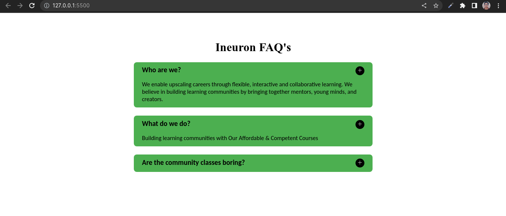

# Accordion Page

In this assignement a reference image was provided and it has to be created using JavaScript.

## Sample Image

 

### All the elemets created using JavaScript only and classes are assigned according to the CSS file given.

## Screenshot
