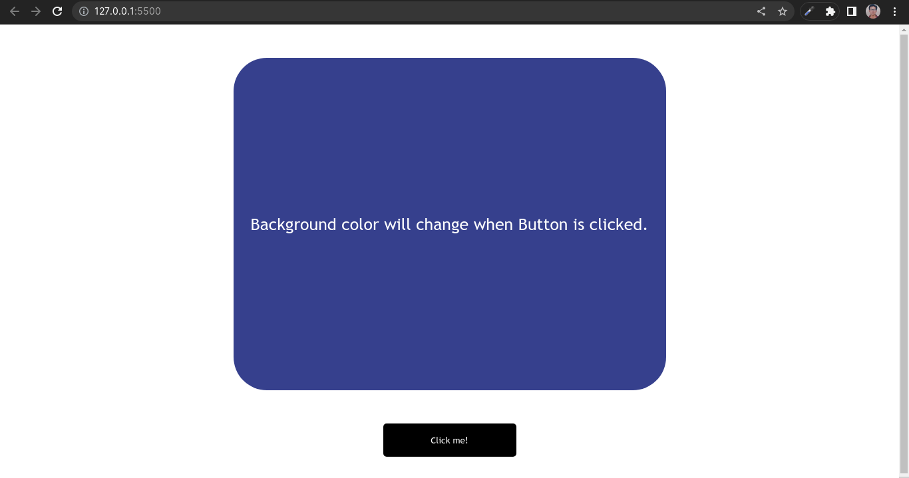

# **Color Changer App**

This project is designed to change the random background color everytime a button is clicked.

## Technology Used
```js
- HTML
- CSS
- JAVASCRIPT
```

## Approach Used
- First approach is to design a **`function`** which can generate random hex-color-codes.
- Secondly, **`div`** is targeted and assigned respective `classes`.
- Finally an **`event-listener`** is added to the button with the above defined **`function`** which change background Color of the `div` when clicked everytime.

<br>

## Screenshot


