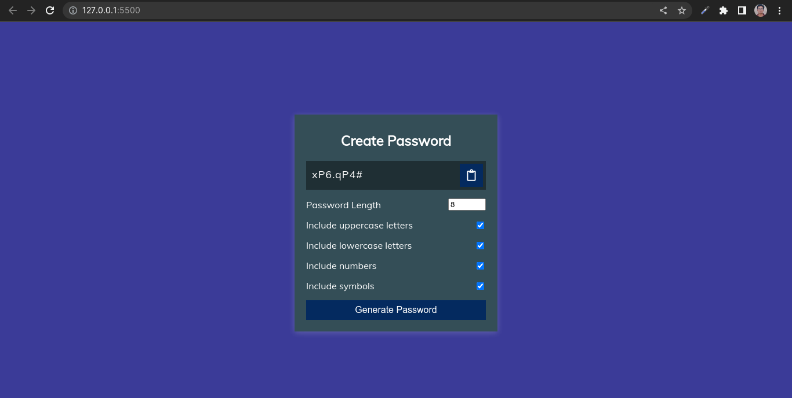

# Password Generator App

## Technology Used:

      HTML
      CSS
      JavaScript

       

## Features

- This **`password generator app`**  designed to generate a random password comprises of numbers, symbols, Upper case and lower case alphabets.
- Required **`length`** of password can also be provided by user.
- User can also decide which type of **`characters`** are required in password.
- Generated password can also be copied to **`clipboard`**.

 

## Screenshot
